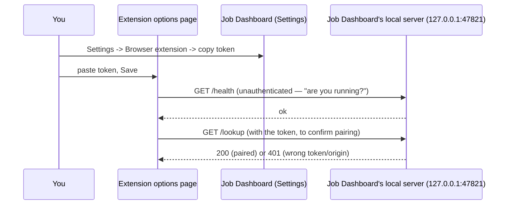
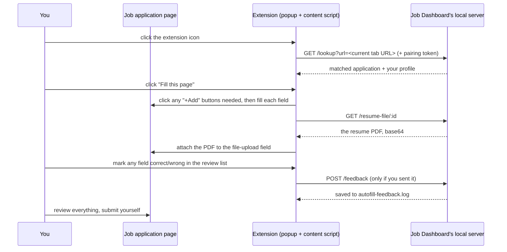
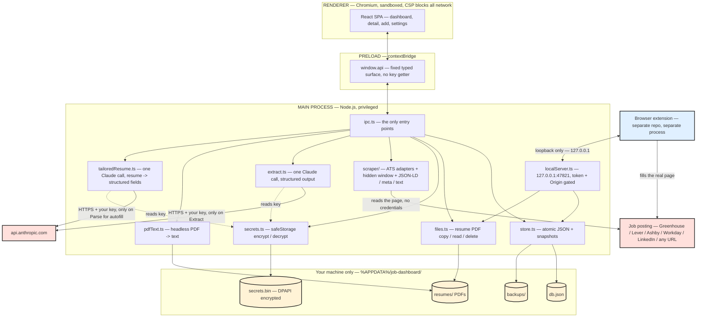
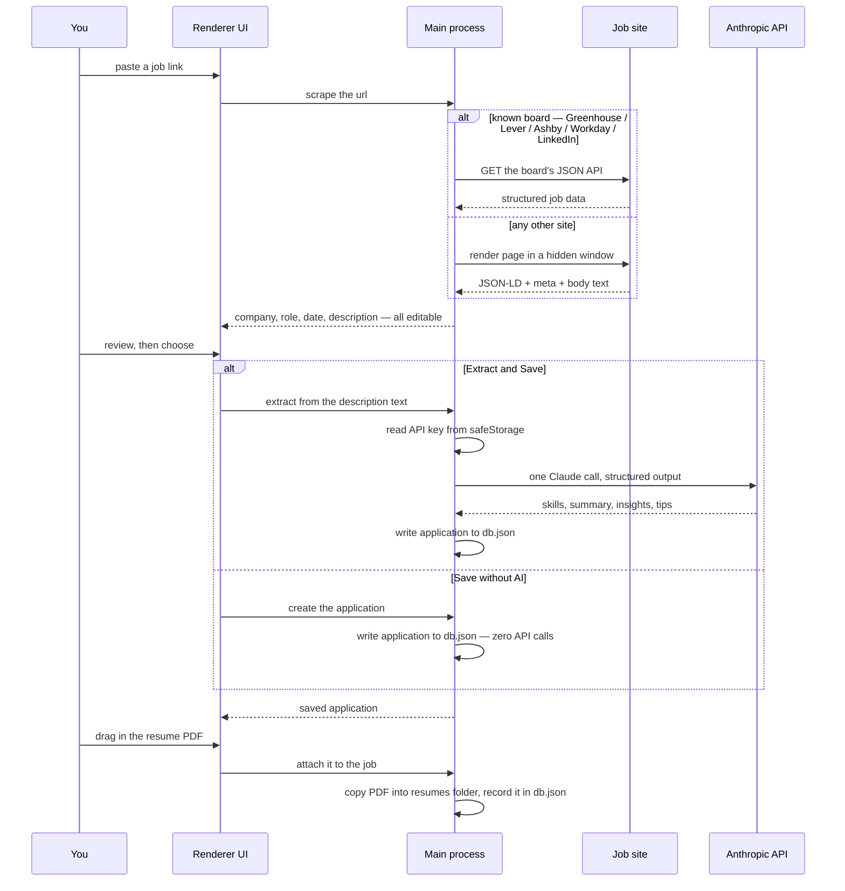

# Job Dashboard

A local, offline **Windows desktop app** for running a job search — every application, the
posting and its skills, the resume you sent, the people who could refer you, the interviews and
follow-ups, and a dashboard that tells you what's actually working.

**Free and open-source. No account, no subscription, no data leaves your machine.**

Paste a job link and the app reads the company, role, description and date for you. Press
**Extract** and one small Claude call pulls out the skills, a summary, "what this company
values", and concrete tailoring tips. Attach the resume you sent. Track it through the pipeline
and the **Overview** turns it into a funnel, response rates, a weekly trend, an interview
calendar, and a "close the loop" list of applications that have gone dead.


### vs. the alternatives

| | Job Dashboard | Huntr / Teal | Simplify / LazyApply | A spreadsheet |
|---|---|---|---|---|
| Price | **free, open-source** | $9–40 / week or month, hard to cancel | subscription | free |
| Your data | **100% on your machine** | their cloud; [job platforms sell data](#your-data--privacy) | their cloud | yours |
| Keeps itself useful | dashboard + nudges | goes stale like any tracker | — | dies by week two |
| Tells you what's working | **funnel, response rate by source/resume, benchmarks** | partial (paywalled) | no | you build the formulas |
| Autofills applications | **yes — from the tailored resume you attached to *that* job**, via a companion browser extension | some — one generic saved profile, wrong once you tailor a resume | that's the pitch, same generic-profile approach | no |
| Interview stage | **per-round log + cross-job calendar** | one "interviewing" status | no | you improvise |

Everything stays on your machine. There is **no account, no cloud server, no sync, no
telemetry**. The only *outbound* network calls are to the job site you paste (to read the
posting) and — only when you press **Extract** or **Parse for autofill** — to the Anthropic API
with *your* key. The one local exception: if you install the companion browser extension (see
[Browser extension](#browser-extension) below), this app runs a small HTTP server bound to
`127.0.0.1` only, so the extension can ask "what's the tailored resume for this job" — nothing
on that server is reachable from outside your machine, and nothing on the internet can reach it
either.

---

## Contents

- [What you need](#what-you-need)
- [Install](#install)
- [First run](#first-run)
- [How it works](#how-it-works)
- [Network & referrals](#network--referrals)
- [To-dos](#to-dos)
- [Using it](#using-it)
- [Browser extension](#browser-extension)
- [Your data & privacy](#your-data--privacy)
- [Tech stack](#tech-stack)
- [Architecture](#architecture)
- [Build it yourself](#build-it-yourself)
- [Project layout](#project-layout)
- [Known limitations (app-wide)](#known-limitations-app-wide)
- [Troubleshooting](#troubleshooting)
- [Security](#security)
- [Versioning](#versioning)
- [License](#license)

---

## What you need

**To run the app:**

| Requirement | Notes |
|---|---|
| Windows 10 or 11, 64-bit | The only supported platform right now. |
| ~250 MB free disk | The app itself; your data adds a few MB. |
| An Anthropic API key | **Optional.** Only needed for the **Extract** feature. Get one at [console.anthropic.com](https://console.anthropic.com/) → *API keys*. You can use the whole app without it — you just won't get the AI-extracted skills/insights. |

**Cost, if you use Extract:** one Claude call per job, only when you press the button.

| Model (pick in Settings) | ~cost per job | best for |
|---|---|---|
| Claude Haiku 4.5 *(default)* | ~$0.007 | skills, keywords, summary |
| Claude Sonnet 5 | ~$0.015 | richer company insights & tailoring tips |

Roughly **100 documented jobs for under $1** on Haiku. Nothing runs automatically or in the
background — you are billed only for button presses.

**To build it from source:** Node.js 20+ (22 recommended), npm, and — only if you want to
regenerate the icon — Python with Pillow. See [Build it yourself](#build-it-yourself).

---

## Install

1. Go to the repo's [**Releases**](../../releases) page and download
   `Job Dashboard-Setup-<version>.exe`.
2. Run it. The installer is **not code-signed**, so Windows SmartScreen will show a blue
   warning — click **More info → Run anyway**. (Or build it yourself, below, if you'd rather
   not trust a prebuilt binary.)
3. The assisted installer lets you choose the folder and whether to install for just you or
   all users. Defaults are fine.
4. Launch **Job Dashboard** from the Start Menu.

To update later, download the newer installer and run it over the top — your data is kept.
To remove it: **Settings → Apps** in Windows, or the *Uninstall Job Dashboard* entry. Your
data folder is left in place unless you delete it yourself.

---

## First run


The app opens to an empty board — **there is no bundled data**. The database is created the
first time it launches, as an empty file in your Windows profile:

```
%APPDATA%\job-dashboard\db.json
```

From here you fill it: add a job, it's saved; add a resume, it's copied in; close and reopen,
everything is still there. If you want the AI features, open **Settings** and paste your
Anthropic API key (it is encrypted by Windows and never leaves your machine except to call
Anthropic).

---

## How it works

### 1. Paste a job link

The app tries hardest-to-easiest to read the posting, **without any AI**:

- **Known job boards** — Greenhouse, Lever, Ashby, Workday and LinkedIn have dedicated readers
  that call the board's own JSON API and get clean, structured fields.
- **Anything else** — the app opens the page in a hidden, isolated browser window, waits for
  it to render, and pulls the `JobPosting` structured-data block (present on a surprising
  number of career pages), the Open Graph tags, and the main body text.
- **If a site blocks it** (some do), you get a *paste the description* box and fill the text
  in yourself.

Out of this it fills: **company, role, location, workplace type, employment type, posting
date, salary range, and the full description** — all editable before you save.

> LinkedIn sometimes needs you signed in. **Settings → Log in to LinkedIn** opens a window
> whose session is remembered and reused for future LinkedIn links.

**Already tracking applications elsewhere?** Sidebar **Import** takes either a list of job
links (one per line — each is scraped, duplicates skipped) or a pasted CSV / spreadsheet /
Huntr-or-Teal export, with a column mapper. No AI, no Extract.

### 2. Save — with or without AI

- **Extract & Save** — makes **one** call to Claude with just the description text. It returns:
  - required / preferred **skills** and **industry / ATS keywords**, ordered by prominence
  - a 2–3 sentence **summary** and the core **responsibilities**
  - **company insights** — text-grounded things worth knowing when you write the resume
  - **tailoring tips** — concrete phrasing and emphasis moves for this specific JD
  - the app highlights the key phrase in each insight/tip like a marker pen
- **Save without AI** — 0 API calls; just stores the scraped facts and the description. You
  can run extraction later from the job's detail view.

The **Skills** tab shows those skills as chips, and — at the bottom — a **Paste into Workday**
box (see [Filling Workday's skills field](#filling-workdays-skills-field)).

### 3. Attach the resume you sent

Drag the PDF onto the job (or pick a file). It's **copied** into the app's data folder — your
original is untouched and can be moved or deleted. You can keep multiple versions per job and
mark one primary. The viewer renders the real PDF exactly (via pdf.js), page by page.

If you plan to use the [browser extension](#browser-extension) to autofill the real
application, click **✦ Parse for autofill** on the resume. One more Claude call reads the PDF's
actual text (headless, no rendering) and extracts a structured
headline/summary/skills/experience list — shown in a fully editable review before anything
saves, since a resume with more than one text column can interleave lines from both columns
(a real limitation of reading PDF text in draw order — this review step exists specifically to
catch that before it reaches a real application).

### 4. Track it, and read the dashboard

Move each job through **Not applied → Applied → Interviewing → Offer / Rejected / Ghosted /
Withdrawn**. Every transition is timestamped, so the **Overview** (home) page can show:

- **KPI row** — total, active pipeline, response rate, interview rate, offers, applied this week
- **Applications over time** — a weekly line of *applied* vs *responded* (toggle cumulative)
- **Funnel** — Applied → Responded → Interviewed → Offered, with the drop-off at each step
- **Response rate by source** and **by tag** — which channels actually reply
- **Upcoming** — every scheduled interview and offer deadline across all jobs, on one timeline,
  with a nudge when an offer is due while other processes are still mid-interview
- **To-dos** due now, and **Needs attention** — quiet 14+ days, **likely dead (30+ days, "archive
  all")**, missing a resume, or interviewing with no prep to-do

A **response** = any reply, *including a rejection* — it means a human saw your application.
Only *Ghosted* counts as no response. It's all visual — no pop-ups, no notifications.

### 5. The interview stage


Once a job is interviewing, an **Interviews** tab appears — log each round (who, when, format,
outcome, prep notes), set the **offer decision deadline**, and one click turns any round into a
dated prep to-do. It all feeds the **Upcoming** timeline so you can see whether to speed a
process up or ask another to wait.

### 6. Everything after that is browsing


The **Applications** tab is the card board — search, the filter rail, sort. Each job's detail
view has the resume beside tabs for **Description · Skills · Insights · Tips · Network ·
Interviews · To-dos · Prompt · Notes · Details** (Interviews only shows once it's relevant).
Page between jobs with the arrows (or `[` / `]`), and the paging respects whatever search or
filter you had on the board.

### The "Prompt" tab


Generates a ready-to-paste prompt containing everything the app knows about the job, wrapped
in a proper structure. Paste it into Claude or ChatGPT with your master resume and you get
back a fit analysis, a skill-by-skill coverage table (every JD requirement mapped to real
experience or flagged as a gap), and line-by-line edits — with rules that forbid inventing
anything.

### Filling Workday's skills field


Workday's "Skills" input is a typeahead against Workday's own taxonomy, and its search box
**merges any paste — commas *or* line breaks — into a single skill**. There is no bulk paste;
the only thing that works is one skill at a time. The bottom of the **Skills** tab has a
**Paste into Workday** box that drives that loop, with **no AI**:

- **Copy next** copies the next skill and advances — paste it into Workday, pick the match from
  the dropdown, hit *Copy next* again. A `4 / 13 added` counter tracks progress.
- Or click any individual chip to copy that one skill out of order.
- **Toggle chips off** to trim the list (Workday recommends 8–15).
- A collapsed **plain list** (one per line) is there for Greenhouse / Lever / Ashby, whose
  skill fields *do* split on line breaks.

---

## Network & referrals

A referred candidate is far more likely to get an interview — this is the part of the app that
helps you actually ask. **No AI is involved anywhere here.**


**Keep your people** — the **Network** section holds contacts: name, email, other accounts
(LinkedIn, GitHub, …), the company they work at, how you know them (former colleague, alum,
recruiter, …), and a line of context you'll reuse in the email.

**They attach to jobs automatically** — put a contact's company as *Bank of America*, and every
BofA role you save shows that person on its **Network** tab. No linking step. Cards on the
dashboard get a small `❋ N` badge when you know people at that company. You can also manually
link a contact to a job they don't work at — a recruiter, or a friend who'll make an intro.


**A referral email, written for you** — hit **Draft email** on any contact and the app builds
a complete message: greeting, the ask (phrased differently for a close colleague vs. an alum
vs. a recruiter), the job link, a fit line drawn from the extracted skills, an easy out, and a
sign-off from your details in **Settings → You**. Edit it, then **Copy email** or **Open in
mail app** (fills your default mail client via `mailto:`). Attach your resume and send.


The structure follows current advice on referral outreach — short, specific, respectful of the
person's time, with a genuine way for them to say no.

---

## To-dos


A lightweight task list for the work *around* the applications — "tailor resume for Acme",
"follow up with the recruiter", "prep for Thursday". Every to-do can stand alone or be
**attached to a job**.

- The **To-dos** sidebar tab is the combined list, grouped **Overdue · Today · This week ·
  Later · No date** (and a collapsed **Done**). Quick-add at the top with `Today` / `Tomorrow`
  / `+1 wk` chips or a date picker; filter by job; tick *show done* to review what's finished.
- Each job's **To-dos** tab shows just that job's tasks, plus **suggested next steps** for its
  current status — "Prep for the interview" when it's *Interviewing*, "Follow up in a week"
  when *Applied*. Click a suggestion to add it; nothing is created on its own.
- The sidebar badge and a dashboard tile show how many are **overdue or due today**.

**This is visual only** — grouping and colour are the whole nudge. There are no pop-ups, no
OS notifications, ever.

---

## Using it

| Feature | How |
|---|---|
| See how the search is going | **Overview** (home) — KPIs, funnel, weekly trend, response rates, needs-attention |
| Add a job | **Add application** in the sidebar, or `Ctrl`+`K` → "Add" |
| Import in bulk | Sidebar **Import** → paste many job links (each is scraped), or paste a CSV / Huntr / Teal export and map the columns |
| Browse the board | **Applications** tab — the card grid |
| Search | The search box in the **Find** panel — fuzzy match across company, role, skills, description, notes |
| Log an interview | Job → **Interviews** tab (appears once it's interviewing) — round, when, who, format, outcome, prep notes; set the offer deadline |
| Clear out dead applications | **Overview → Needs attention → Close the loop → Archive all** (kept, just hidden; still counts in the funnel) |
| Filter | **Find** panel — status, employment type, workplace, applied-date range, tag, source board, "has a resume", "AI-extracted", "archived" |
| Sort | **Find** panel — newest/oldest applied, recently posted, company A–Z |
| Track status | Per job: **Not applied → Applied → Interviewing → Offer / Rejected / Ghosted / Withdrawn**. New jobs start **Not applied**; flip to **Applied** when you submit and it stamps the date. |
| Tag jobs | Free-text tags with colours (e.g. `dream`, `referral`) |
| Fill Workday's skills field | Job → **Skills** tab → **Paste into Workday** — *Copy next* → paste → pick the match → repeat |
| Add a to-do | **To-dos** tab (or a job's **To-dos** tab) → type, press Enter. Add a due date with the chips or the picker. |
| Track what's next per job | A job's **To-dos** tab → click a **suggested** step, or add your own |
| Add a contact | **Network → Add contact**, or `Ctrl`+`K` |
| See who can refer you | A job's **Network** tab — contacts at that company appear automatically; link others by hand |
| Draft a referral email | **Draft email** on any contact → edit → **Copy** or **Open in mail app** |
| Set your sign-off | **Settings → You** — name, email, phone, LinkedIn (used only in the drafted emails) |
| Set your address | **Settings → You → Address** — City has worldwide autocomplete; picking a suggestion also fills State and Country |
| Command palette | `Ctrl`+`K` — jump to any job or contact, add, or open Settings |
| Re-run extraction | Job detail → **Re-run extraction** (one more Claude call) |
| Parse a resume for autofill | Job → resume pane → **✦ Parse for autofill** → review → save |
| Pair the browser extension | **Settings → Browser extension** → copy the pairing token → paste into the extension's Options page — see [Browser extension](#browser-extension) |
| Autofill a real application | Open the application page → click the extension icon → **Fill this page** |
| Back up | **Settings → Export a copy now** writes `db.json` + all resumes to a folder you choose |
| Restore | **Settings → Automatic backups** — the app snapshots `db.json` on every launch (keeps the last 20) and can roll back |

---

## Browser extension

A companion **Chrome extension** (a separate sibling repo,
[`job-dashboard-extension`](../job-dashboard-extension)) autofills a real job application form
from **the JD-tailored resume you already attached to that specific job** — not one generic
saved profile like Simplify, LazyApply, or Teal use. Different job, different tailored resume,
different autofill — that's the entire point of it.

### Install it

Not published on the Chrome Web Store (a personal tool, sideloaded — this costs nothing and
works indefinitely for personal use). It's a separate repo, `job-dashboard-extension`, meant to
live as a sibling folder next to this one — see that repo's own README for exact install/build
notes; the short version:

1. Get the `job-dashboard-extension` folder onto your machine, next to this repo (clone it if
   it's hosted somewhere, or copy the folder directly).
2. In Chrome, open `chrome://extensions`, turn on **Developer mode** (top right toggle).
3. Click **Load unpacked** → select the `job-dashboard-extension` folder.
4. The extension's icon appears in your toolbar. Pin it (puzzle-piece icon → pin) so it's
   always visible.

### Pair it to Job Dashboard (one-time)

The extension needs a pairing token so only *your* Job Dashboard install can talk to it:

1. In Job Dashboard: **Settings → Browser extension** → copy the pairing token shown there.
2. Click the extension's icon → **Options** (or right-click the icon → *Options*).
3. Paste the token, click **Save**. It should confirm the connection.



### Use it

1. Attach a resume to the job in Job Dashboard and click **✦ Parse for autofill** on it (see
   [How it works, step 3](#3-attach-the-resume-you-sent)) — the extension fills from this
   parsed data, not the raw PDF.
2. Open the **real application page** for that job in your browser.
3. Click the extension's icon:
   - If the page's URL matches a saved application exactly (or the same job posting on the
     same ATS under a different URL), it fills immediately.
   - If it can't tell which job you mean, it shows a picker of your 5 most recent applications.
4. Click **Fill this page**. It fills every field it recognizes (name, contact info, address,
   work authorization, EEO questions, and the specific experience/education entries from your
   tailored resume) and attaches the resume PDF to any file-upload field it finds.
5. For Experience/Education sections gated behind a **"+ Add"** button, it clicks "+Add" itself
   — once per real entry your tailored resume actually has, never more — before filling each
   revealed row from that entry's own data.
6. **Review everything before submitting.** This never submits a form or advances a multi-step
   wizard on its own, and the file-attach step is best-effort — some ATS platforms (Workday
   especially) don't always confirm a programmatically-set file was truly accepted by their own
   validation.
7. Right after a fill, the extension's popup shows a ✓/✗ review list for each field it touched.
   Mark anything wrong and optionally note what it should have been, then **Send feedback** —
   this is saved as a plain-text log on your machine (`autofill-feedback.log`, next to your
   other Job Dashboard data) to help identify patterns worth fixing in a future update. It is
   **not** sent anywhere, and it does not train any model — it's a diagnostic log for a human
   (you, or a future coding session) to read.



### Known limitations

- Requires Job Dashboard to be running (the local server it talks to lives inside the app).
- Custom-styled dropdowns for EEO questions (not a real native `<select>`) aren't handled —
  fill those in by hand.
- File-attach can silently fail to register on some ATS's own JS validation even though the
  extension successfully set the input — always double-check before submitting.
- **A small number of ATS text fields can mangle a long pasted description on their own end**
  — one confirmed case (a SmartRecruiters application) inserted spurious spaces mid-word
  ("firmware" → "fir mware") purely from that site's own form component reflowing a large
  block of pasted text, independently verified by reading the actual stored (clean) source
  data straight out of this app's database. This is a bug in that ATS's own field, not in Job
  Dashboard or the extension — if you hit it, the safest fix is to correct the field by hand
  after filling.

---

## Your data & privacy

Everything lives in one folder in your Windows profile:

```
%APPDATA%\job-dashboard\
├─ db.json                  applications, interviews, contacts, to-dos, your sign-off,
│                            extracted resume data, and the extension's pairing token
│                            (plain JSON — the token is a random local secret, not your API key)
├─ resumes\<job-id>\*.pdf   copies of the resumes you attached
├─ backups\db-*.json        automatic snapshots of db.json (last 20)
├─ secrets.bin              your Anthropic API key, encrypted by Windows (DPAPI)
├─ autofill-server.log      request log for the local extension server (diagnostic only —
│                            written if you install the browser extension; masked tokens)
└─ autofill-feedback.log    per-field autofill feedback you chose to send, one JSON line
                             each (diagnostic only — see "Browser extension" above)
```

- **None of this is in this repository.** The repo is code only. A fresh install starts with
  an empty `db.json` and no key. Your applications, resumes and key are yours and stay on your
  machine.
- **No telemetry, no analytics, no auto-update, no account — and nothing is ever sold.**
  Investigations have found [8 of 9 job-search platforms sell user data](https://privacyrights.org/resources-tools/advocacy/job-search-industry-privacy-concerns-letter-federal-trade-commission)
  and share it with an average of 5+ third parties. This app makes **zero** outbound network
  calls except to the job page you paste and (only on **Extract**/**Parse for autofill**) to
  Anthropic with your own key. The one *inbound* surface is the local server the browser
  extension talks to (see below) — bound to `127.0.0.1` only, unreachable from any other
  machine or from the internet.
- The renderer (the UI) is sandboxed and — enforced by a Content-Security-Policy — cannot make
  any network request at all. The scraping happens in the main process; the one AI call
  happens in the main process with your key, which the UI can never read.
- If you install the browser extension, this app additionally runs a plain HTTP server on
  `127.0.0.1:47821` while it's open, so the extension can ask "what's the tailored resume for
  this job." It requires a random pairing token (generated once, stored in `db.json`) on every
  request, and separately checks the request's Origin to reject anything that isn't the
  extension itself — a normal webpage cannot talk to it even if it tried. See the extension
  repo's own README for the full request/response flow.
- To move to a new machine: copy the whole `%APPDATA%\job-dashboard\` folder.

---

## Tech stack

| Layer | Choice | Why |
|---|---|---|
| Shell | [Electron](https://www.electronjs.org/) 33 | one language (TS) for a real desktop app; its bundled Chromium doubles as the job-page scraper |
| Build / bundler | [electron-vite](https://electron-vite.org/) 5 (Vite 7, Rollup) | fast HMR in dev, clean `main` / `preload` / `renderer` split |
| Packaging | [electron-builder](https://www.electron.build/) 26 → NSIS | one `.exe` installer for Windows |
| UI | [React](https://react.dev/) 18 + TypeScript 5 | — |
| Routing | React Router 6 (hash history) | client-side, no navigation |
| Styling | [Tailwind CSS](https://tailwindcss.com/) 3 + a hand-built neobrutalist component set | thick borders, hard shadows, bold colour |
| Motion | [Framer Motion](https://www.framer.com/motion/) 11 | hover/press springs, list transitions; respects "reduce motion" |
| Search | [Fuse.js](https://www.fusejs.io/) 7 | fuzzy in-memory search over the records |
| PDF | [pdf.js](https://mozilla.github.io/pdf.js/) (`pdfjs-dist` 4.10) | exact canvas rendering of the real file — no text conversion. Also used headless (its legacy Node build) to extract plain text for **Parse for autofill**, with no browser/canvas involved |
| Data store | one atomic JSON file — `src/main/jsondb.ts`, ~60 lines | personal scale; portable; no native module to compile |
| Secrets | Electron `safeStorage` (Windows DPAPI) | key encrypted at rest, main-process only |
| AI | [`@anthropic-ai/sdk`](https://github.com/anthropics/anthropic-sdk-typescript) | structured-output extraction (JD → skills/insights, resume → tailored fields); runs in the main process |
| Local API | plain `node:http`, `127.0.0.1:47821` | lets the companion browser extension read this app's data — no framework, no external dependency |
| City data | `country-state-city` (dev-only) → generated static list | worldwide city/state/country autocomplete in Settings, code-split and lazy-loaded; the package itself never ships in the app |
| Fonts | Space Grotesk + Inter + JetBrains Mono, self-hosted | offline, no CDN |

No database engine, no ORM, no state-management library, no CSS-in-JS runtime, no backend.

---

## Architecture

Electron splits into three contexts. The **main** process is Node.js and does everything
privileged (files, network, the API key). The **renderer** is the sandboxed Chromium UI. The
**preload** is a tiny, audited bridge that exposes a fixed set of typed functions
(`window.api.*`) and nothing else.



### Adding a job — the data flow



---

## Build it yourself

```bash
git clone https://github.com/deepak-s-2001/job_dashboard.git
cd job_dashboard
npm install
```

| Command | What it does |
|---|---|
| `npm run dev` | electron-vite dev server + hot reload — the app opens against your real data dir |
| `npm run typecheck` | `tsc` for both the main and renderer projects |
| `npm run build` | compile everything to `out/` |
| `npm run dist` | `build` + package a Windows installer to `release/Job Dashboard-Setup-<version>.exe` |
| `npm run dist:dir` | same but leaves the unpacked app in `release/win-unpacked/` (no installer) |

The build is reproducible from source: a clean `git clone` + `npm ci` + `npm run dist` on a
matching Node version (see `engines` in `package.json`) produces a working installer with the
same functional contents — verified by rebuilding from a fresh clone against this exact commit.
The `.exe` itself is **not byte-identical** between builds (NSIS/asar packing embeds timestamps),
so don't rely on comparing hashes to verify a download — read the source instead. It is unsigned;
sign it yourself with `signtool` if you need to distribute it without the SmartScreen prompt.

**Dev-only knobs** (compiled out of packaged builds): `JOBDASH_DATA_DIR=<path>` runs against a
throwaway data folder; `SMOKE=<png> SMOKE_HASH=<route>` takes a one-off screenshot;
`SMOKE_SCRAPE=<url>` prints what the scraper got for a link.

**Regenerate the icon** (optional): `python build/make_icon.py` (needs `pip install pillow`).

---

## Project layout

```
src/
  main/                 Electron main process (Node.js)
    index.ts            window creation, security policy, lifecycle
    ipc.ts              every ipcMain.handle — the app's API surface
    store.ts            db.json read/write, migrations, backups
    jsondb.ts           ~60-line atomic JSON store (temp file + rename)
    files.ts            resume PDF copy / read / delete
    secrets.ts          API key encrypt/decrypt via safeStorage
    extract.ts          the single Claude call + structured-output schema
    aiHelpers.ts        shared coercion helpers (asStrOrNull, etc.) for both AI calls
    pdfText.ts          headless PDF -> plain text (pdfjs-dist legacy Node build)
    tailoredResume.ts   resume text -> structured fields, second Claude call
    localServer.ts      127.0.0.1 HTTP server the browser extension talks to
    scraper/
      index.ts          orchestration: adapter → render → parse
      render.ts         hidden BrowserWindow, in-page text/JSON-LD extraction
      jsonld.ts         parse schema.org JobPosting
      htmltext.ts       regex HTML→text for API fragments
      adapters/         greenhouse, lever, ashby, workday, linkedin
  preload/
    index.ts            contextBridge — the window.api definition
  renderer/             React SPA
    src/routes/         Overview, Applications, Detail, Add, Import, Todos, Network, Settings
    src/components/      AppCard, FilterRail, PdfViewer, JobPrompt, CityInput, ui/*
    src/lib/            api client, fuse setup, filters, formatting, prompt builder,
                         usLocations.ts (city/state/country autocomplete + parsing)
  shared/
    types.ts            data model, shared by all three contexts
    ipc.ts              IPC channel-name constants
```

---

## Known limitations (app-wide)

- **Windows only, 64-bit.** No macOS/Linux build exists yet.
- **Multi-column resumes** (a sidebar next to a main column) can have their text interleaved
  when read by **Parse for autofill** — `pdfjs` reports text in draw order, not visual reading
  order, so a genuinely two-column layout can mix lines from both columns. This is why that
  feature always shows a full editable review before saving anything; a single-column resume
  (the common case) is unaffected.
- **Some career sites actively block automated reads.** You'll see the *paste the description*
  fallback box in that case — nothing silently fails.
- **The browser extension has its own limitations** — see [Browser extension → Known
  limitations](#known-limitations) above, including a specific ATS-side bug (not this app's)
  that can mangle a long pasted field on that site's own end.
- The installer is **unsigned** (no code-signing certificate) — Windows SmartScreen will warn
  on first run. Build from source yourself if you'd rather not click through that.

---

## Troubleshooting

| Symptom | Fix |
|---|---|
| SmartScreen blocks the installer | **More info → Run anyway**. It's unsigned, not malicious — build from source if you'd rather. |
| A job link fills in poorly | Some sites block automated reads. Edit the fields, or use the *paste the description* box. From source you can debug with `SMOKE_SCRAPE="<url>" npx electron .` |
| LinkedIn links come back empty | **Settings → Log in to LinkedIn**, then retry. |
| "Add your Anthropic API key" on Extract | **Settings** → paste a key from [console.anthropic.com](https://console.anthropic.com/). The app works without it — just skip Extract. |
| A resume won't display | The PDF must still exist where it was copied (`%APPDATA%\job-dashboard\resumes\`). Re-attach it if you moved/cleaned that folder. |
| Something looks wrong after an import | **Settings → Automatic backups → Restore** a snapshot from before. |

---

## Security

- The renderer runs **sandboxed**, with `contextIsolation` on and `nodeIntegration` off, and a
  Content-Security-Policy that blocks **all** renderer network requests. It also cannot
  navigate off its own page.
- The Anthropic API key is stored **encrypted** (Windows DPAPI via `safeStorage`), only in the
  main process. There is no IPC channel that returns it; it never appears in `db.json`, an
  export, a backup, or a log.
- Job pages are scraped in a **separate window with no bridge to the app** — a hostile page
  can't reach your data or your key.
- Debug hooks are compiled out of packaged builds.

Full notes and the audit that established this are in the commit history.

---

## Versioning

This app and the browser extension are versioned **independently** — `package.json` here,
`manifest.json` in the extension repo — each starting at `1.0.0`. Semver-ish: patch (`1.0.x`)
for fixes, minor (`1.x.0`) for new features, major only for a real breaking change to the data
model or the extension's local-API contract.

---

## License

MIT — see [LICENSE](LICENSE). Use it, fork it, ship your own version; no warranty.
